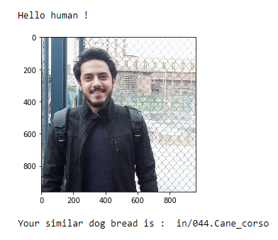
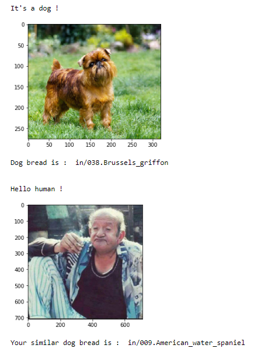

[//]: # (Image References)

[image1]: ./images/sample_dog_output.png "Sample Output"
[image2]: ./images/vgg16_model.png "VGG-16 Model Keras Layers"
[image3]: ./images/vgg16_model_draw.png "VGG16 Model Figure"
# Deep learning Classification project

## Dog-Bread-Classifier-Project

### Project Overview

Welcome to the Convolutional Neural Networks (CNN) project in the AI Nanodegree! In this project, I  learned how to build a pipeline that can be used within a web or mobile app to process real-world, user-supplied images.  Given an image of a dog, your algorithm will identify an estimate of the canine’s breed.  If supplied an image of a human, the code will identify the resembling dog breed.

CNN trained on AWS.

### steps i take to completeing the project:

Step 0: Import Datasets

Step 1: Detect Humans

Step 2: Detect Dogs

Step 3: Create a CNN to Classify Dog Breeds (from Scratch)

Step 4: Use a CNN to Classify Dog Breeds (using Transfer Learning)

Step 5: Create a CNN to Classify Dog Breeds (using Transfer Learning)

Step 6: Write your Algorithm

Step 7: Test Your Algorithm

And each step details are documented on the notebook.

![Sample Output][image1]

### Here is sample output of any input images:

